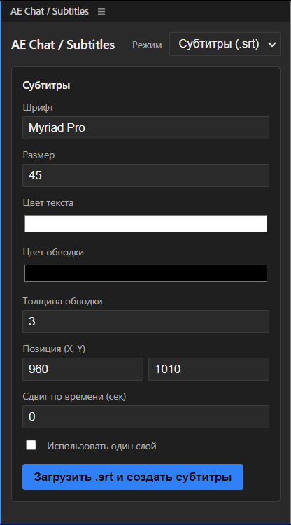
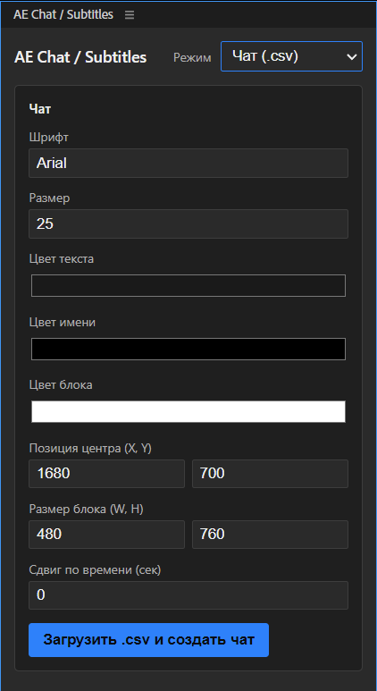
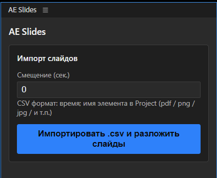

# AE utility plugins

## AE Chat \ Subtitles [AeChatSubs]

Имеет два режима: субтитры и чат.

### Субтитры

Импортирует субтитры в формате `.srt` и вставляет на таймлайн текстовые сообщения в соответствующие промежутки времени.

Настройки:



Пример заполнения srt-файла:
```srt
1
00:00:16,350 --> 00:00:19,669
Hello, everyone!

2
00:00:19,789 --> 00:00:24,019
We are starting our podcast
```
### Чат

Импортирует данные в формате `.csv` в формате `время (секунды); имя пользователя; сообщение` и генерирует прямоугольник (далее "бокс"),
в котором будут появляться сообщения в соответствующее время на таймлайне.

Настройки:



Пример заполнения csv-файла:
```csv
57;Lupa;Hello. I can hear and see.
57;Pupa;I can hear and see it well
63;Biba;Hello
67;Boba;+
```

## AE Slides [AeSlides]

Импортирует данные в формате `.csv` и вставляет слайды на таймлайн в соответствующее время.

Настройки:



Пример заполнения csv-файла:
```csv
1;Slides_Part1.pdf
261;Slides_Part2.pdf
294;Slides_Part3.pdf
562;Slides_Part4.pdf
```
